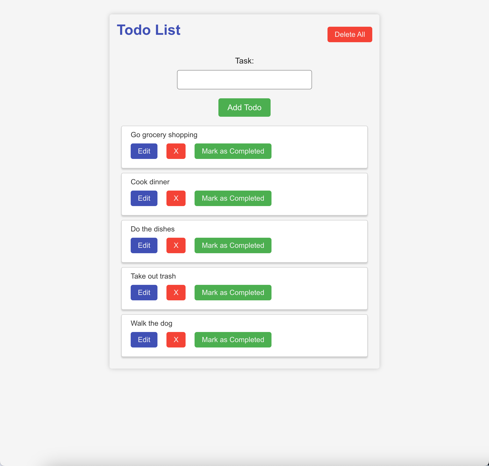

# Todo App - List, Add, Remove Todos

Create a Todo App that allows users to see, add, edit, and remove todos. It should contain the following components.

* App - this component should render the TodoList component
* TodoList - this component should render the NewTodoForm component and should render the list of Todo components. Place your state that contains all of the todos in this component.
* NewTodoForm - this component should render a form with one text input for the task to be created. When this form is submitted, a new Todo component should be created. - Todo- this component should display a div with the task of the todo.
* For each Todo component, there should also be a button with the text “X” that when clicked, removes the todo.

### Further Study
* It’s time to edit some todos! Each Todo component should also display a button with the text “edit” that when clicked, displays form with the task of the todo as an input and a button to submit the form. When the form is submitted, the task of the text should be updated and the form should be hidden.
* When each Todo component is displayed, add a button with the text of “Mark as completed”. When this button is clicked, add a strike through the text of the todo.
* Instead of a button that when clicked adds a strike through, refactor your application so that when that button is clicked, if the todo is completed (something each todo will have in state), add a strike through, otherwise if a todo is not completed, remove the strike through.
* Add some styling to your application! Try to use a CSS animation that fades out a Todo when it is deleted (this will involve adding/removing CSS classes). Write this using SASS!
* Save your todos in localStorage and retrieve them when the page loads.

### Getting Started with Create React App

This project was bootstrapped with [Create React App](https://github.com/facebook/create-react-app).

#### Available Scripts

In the project directory, you can run:

#### `npm start`

Runs the app in the development mode.\
Open [http://localhost:3000](http://localhost:3000) to view it in your browser.

The page will reload when you make changes.\
You may also see any lint errors in the console.

#### `npm test`

Launches the test runner in the interactive watch mode.\
See the section about [running tests](https://facebook.github.io/create-react-app/docs/running-tests) for more information.

